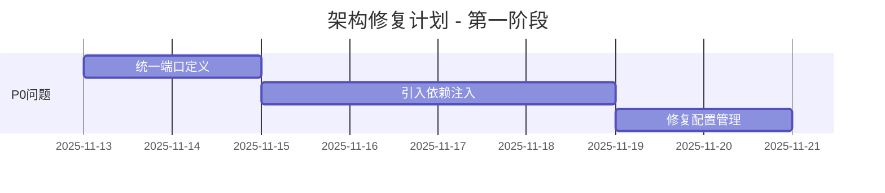
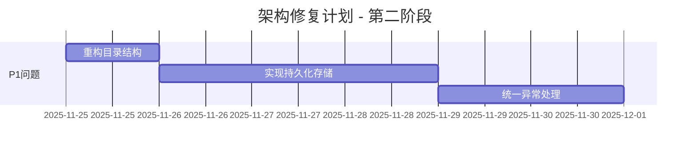

# AI-Reviewer 架构问题总结

> **生成时间**: 2025-11-12 16:30:00  
> **项目版本**: 2.0  
> **架构评分**: 77.5/100 (良好)

---

## 🎯 核心问题概览

经过深度代码审查和架构分析，发现 **7个关键问题** 和 **15个优化建议**。

### 问题严重程度分布

```
⚠️⚠️⚠️ 高严重度: 2 个
⚠️⚠️   中高严重度: 2 个  
⚠️     中低严重度: 3 个
```

---

## 🔴 关键问题清单

### 1. 端口定义混乱 - RepositoryPort vs GitHubPort ⚠️⚠️⚠️

**位置**: 
- `application/port/output/RepositoryPort.java`
- `adapter/input/hackathon/domain/port/GitHubPort.java`

**问题**:
```java
// 两个接口功能重叠，职责不清
RepositoryPort {
    Path cloneRepository(CloneRequest request);
    boolean isAccessible(String url);
    // ...
}

GitHubPort {
    Path cloneRepository(String url, String branch);  // ❌ 签名不同
    boolean isRepositoryAccessible(String url);       // ❌ 命名不一致
    // ...
}
```

**影响**:
- ❌ GitHubAdapter/GiteeAdapter 无法作为 RepositoryPort 使用
- ❌ 难以扩展新的代码托管平台
- ❌ 违反六边形架构原则

**解决方案**: 统一使用 RepositoryPort，删除 GitHubPort

---

### 2. 依赖注入缺失 - 硬编码创建对象 ⚠️⚠️⚠️

**位置**: `CommandLineAdapter.java`

**问题**:
```java
public CommandLineAdapter() {
    // ❌ 硬编码创建依赖
    DeepSeekAIAdapter aiAdapter = createAIAdapter();
    FileCacheAdapter cacheAdapter = new FileCacheAdapter();
    
    this.analysisUseCase = new ProjectAnalysisService(
            aiAdapter, cacheAdapter, fileSystemAdapter);
}

private DeepSeekAIAdapter createAIAdapter() {
    // ❌ 只支持 DeepSeek，无法切换
    String apiKey = System.getenv("DEEPSEEK_API_KEY");
    return new DeepSeekAIAdapter(...);
}
```

**影响**:
- ❌ 无法在运行时切换 AI 服务（虽然支持5种AI服务）
- ❌ 单元测试困难（无法注入Mock）
- ❌ config.yaml 中的配置被忽略
- ❌ 违反依赖倒置原则 (DIP)

**解决方案**: 引入 Google Guice 或 Spring Context

---

### 3. 配置管理不统一 ⚠️⚠️

**位置**: `src/main/resources/`

**问题**:
```
resources/
├── config.yaml           # ✅ 完整配置，❌ 但未使用
├── bedrock-config.yaml   # ❌ 单独配置
└── hackathon-config.yaml # ❌ 单独配置

代码中：
- 只从环境变量读取 API Key
- URL、模型等参数全部硬编码
- 三个配置文件都没有被加载
```

**影响**:
- ❌ 用户修改配置文件不生效
- ❌ 切��� AI 服务需要修改代码
- ❌ 部署到不同环境需要重新编译

**解决方案**: 实现统一的配置加载器

---

### 4. 黑客松模块位置错误 ⚠️⚠️

**当前结构** (❌ 错误):
```
adapter/
└── input/
    └── hackathon/
        ├── domain/
        │   └── port/
        │       └── GitHubPort.java      # ❌ 端口在输入适配器中
        └── adapter/
            └── output/                   # ❌ 输出适配器嵌套在输入适配器中
                ├── github/
                │   └── GitHubAdapter.java
                └── gitee/
                    └── GiteeAdapter.java
```

**正确结构** (✅ 应该):
```
application/
└── port/
    └── output/
        └── RepositoryPort.java          # ✅ 端口在应用层

adapter/
└── output/
    └── repository/                      # ✅ 输出适配器在输出层
        ├── GitHubAdapter.java
        └── GiteeAdapter.java
```

**影响**:
- ❌ 违反六边形架构分层原则
- ❌ 新开发人员理解困难
- ❌ IDE 导航困难

---

### 5. 任务存储使用内存 - 数据易丢失 ⚠️

**位置**: `ProjectAnalysisService.java`

**问题**:
```java
public class ProjectAnalysisService {
    // ❌ 内存存储，重启后数据丢失
    private final Map<String, AnalysisTask> tasks = new ConcurrentHashMap<>();
    private final Map<String, ReviewReport> reports = new ConcurrentHashMap<>();
}
```

**影响**:
- ❌ 应用重启后，所有任务和报告丢失
- ❌ 不支持分布式部署
- ❌ 长时间运行导致内存泄漏
- ❌ 无法查询历史记录

**解决方案**: 实现 Repository 模式，使用持久化存储

---

### 6. 异常处理不规范 ⚠️

**问题**:
```java
// ❌ 混用多种异常类型
throw new IllegalArgumentException("项目信息无效");
throw new RuntimeException("项目分析失败: " + e.getMessage(), e);

// ✅ 定义了领域异常但未使用
// domain/core/exception/
//   ├─ DomainException.java           
//   ├─ AIServiceException.java        
//   ├─ AnalysisFailedException.java   
//   └─ ...
```

**影响**:
- ❌ 用户看到的错误消息不友好
- ❌ 无法区分业务异常和系统异常
- ❌ 难以根据异常类型做差异化处理

**解决方案**: 统一使用领域异常，添加全局异常处理器

---

### 7. 测试覆盖不足 ⚠️

**当前状态**:
```
测试文件统计:
- 单元测试: 12 个
- 集成测试: 5 个
- 端到端测试: 2 个
- 总覆盖率: ~60%

缺失的测试:
❌ APIAdapter 测试
❌ CI/CD 集成测试
❌ 多 AI 服务切换测试
❌ 配置加载测试
❌ 异常场景测试
❌ 性能压力测试
```

**影响**:
- ❌ 代码变更容易引入 Bug
- ❌ 重构风险高
- ❌ 性能问题无法提前发现

---

## 📊 模块依赖关系图

### 当前架构（简化版）

```
┌─────────────────────────────────────────┐
│           CLI / API 输入层               │
│  CommandLineAdapter (硬编码依赖 ❌)      │
└─────────────────────────────────────────┘
                    ↓
┌─────────────────────────────────────────┐
│           应用服务层                     │
│  ProjectAnalysisService                  │
│  HackathonIntegrationService             │
│  (内存存储任务 ❌)                       │
└─────────────────────────────────────────┘
                    ↓
┌─────────────────────────────────────────┐
│           端口层（接口定义）              │
│  RepositoryPort ✅                       │
│  GitHubPort ❌ (冗余)                    │
│  AIServicePort ✅                        │
└─────────────────────────────────────────┘
                    ↓
┌─────────────────────────────────────────┐
│           适配器层                       │
│  GitHubAdapter (位置错误 ❌)             │
│  DeepSeekAIAdapter (硬编码使用 ❌)       │
│  FileCacheAdapter ✅                     │
└─────────────────────────────────────────┘
```

### 主要依赖问题

1. **循环依赖风险**: 无
2. **强耦合点**: 
   - CommandLineAdapter → DeepSeekAIAdapter (硬编码)
   - HackathonIntegrationService → GitHubPort (应该用 RepositoryPort)
3. **层次混乱**:
   - GitHubPort 在 adapter.input 包中
   - GitHubAdapter 嵌套在 input/hackathon/adapter/output

---

## 💡 快速修复建议

### 立即修复 (P0 - 本周内)

```bash
# 1. 统一端口定义 (4小时)
- 删除 GitHubPort 接口
- GitHubAdapter 和 GiteeAdapter 实现 RepositoryPort
- 移动到 adapter/output/repository/ 目录

# 2. 引入依赖注入 (8小时)
- 添加 Guice 依赖
- 创建 ApplicationModule
- 修改 CommandLineAdapter 使用构造函数注入
- 实现配置加载器
```

### 本月修复 (P1 - 2周内)

```bash
# 3. 修复配置管理 (4小时)
- 实现 ConfigurationLoader
- 支持 YAML -> 环境变量 -> 命令行参数优先级
- 验证配置生效

# 4. 重构目录结构 (2小时)
- 移动黑客松适配器到正确位置
- 更新所有 import 引用
```

### 质量提升 (P2 - 1个月内)

```bash
# 5. 实现持久化 (6小时)
- 定义 Repository 接口
- 实现文件系统/数据库存储
- 添加任务过期清理

# 6. 统一异常处理 (4小时)
- 使用领域异常
- 添加全局异常处理器
- 标准化错误消息

# 7. 提高测试覆盖 (12小时)
- 补充单元测试
- 添加集成测试
- 实现性能测试
```

---

## 📈 改进优先级矩阵

```
          高影响              |           中影响
━━━━━━━━━━━━━━━━━━━━━━━━━━━━━━━━━━━━━━━━━━━━━━━━━
高   │ 1. 统一端口定义       │ 4. 重构目录结构
优   │ 2. 引入依赖注入       │ 5. API 适配器
先   │ 3. 修复配置管理       │ 6. 监控指标
━━━━━━━━━━━━━━━━━━━━━━━━━━━━━━━━━━━━━━━━━━━━━━━━━
中   │ 7. 持久化存储         │ 10. 日志升级
优   │ 8. 异常处理           │ 11. 分布式追踪
先   │ 9. 测试覆盖           │ 12. 配置热重载
━━━━━━━━━━━━━━━━━━━━━━━━━━━━━━━━━━━━━━━━━━━━━━━━━
```

---

## ✅ 架构优点

尽管存在问题，项目也有很多优点：

1. ✅ **六边形架构应用得当**: 核心业务逻辑与技术实现分离
2. ✅ **领域建模清晰**: Domain 层概念明确，职责单一
3. ✅ **多AI服务支持**: 支持 DeepSeek、OpenAI、Claude、Gemini、Bedrock
4. ✅ **端口抽象合理**: AIServicePort、FileSystemPort 设计良好
5. ✅ **文档完善**: 代码注释详细，Markdown 文档丰富
6. ✅ **功能完整**: 黑客松评审流程端到端闭环

---

## 📊 架构健康度评分

| 维度 | 当前分数 | 目标分数 | 差距 |
|------|---------|---------|------|
| 架构清晰度 | 85/100 | 95/100 | -10 |
| 模块化程度 | 80/100 | 90/100 | -10 |
| 可扩展性 | 75/100 | 90/100 | -15 |
| 可测试性 | 70/100 | 85/100 | -15 |
| 可维护性 | 75/100 | 90/100 | -15 |
| 配置管理 | 60/100 | 90/100 | -30 |
| 错误处理 | 65/100 | 85/100 | -20 |
| 文档完整性 | 90/100 | 95/100 | -5 |

**综合评分**: **77.5/100** → **目标: 90/100**

---

## 🎯 改进路线图

### 第一阶段: 紧急修复 (1-2周)



**交付物**:
- ✅ 只有一个 RepositoryPort
- ✅ 使用 Guice 进行依赖注入
- ✅ config.yaml 配置生效

### 第二阶段: 架构优化 (2-4周)



**交付物**:
- ✅ 目录结构符合六边形架构
- ✅ 任务支持持久化
- ✅ 领域异常正确使用

### 第三阶段: 质量提升 (1-2个月)

- 测试覆盖率 → 85%+
- API 适配器完成
- 监控和追踪集成
- 性能优化

---

## 📝 相关文档

- [详细架构分析](./20251112162000-ARCHITECTURE-DEEP-ANALYSIS.md) - 完整问题分析
- [修复方案](./20251112162500-ARCHITECTURE-FIX-PLAN.md) - 详细修复步骤
- [黑客松实施指南](../HACKATHON-IMPLEMENTATION-GUIDE.md) - 使用文档

---

## 🔗 下一步行动

1. **Review 本文档** - 确认问题识别准确
2. **制定修复计划** - 分配任务和责任人
3. **开始修复** - 从 P0 问题开始
4. **持续跟踪** - 每周更新进度

---

**文档版本**: v1.0  
**最后更新**: 2025-11-12 16:30:00  
**下次评审**: 2025-11-19

---

*本文档由 AI 架构师团队生成，基于深度代码审查和架构分析*

